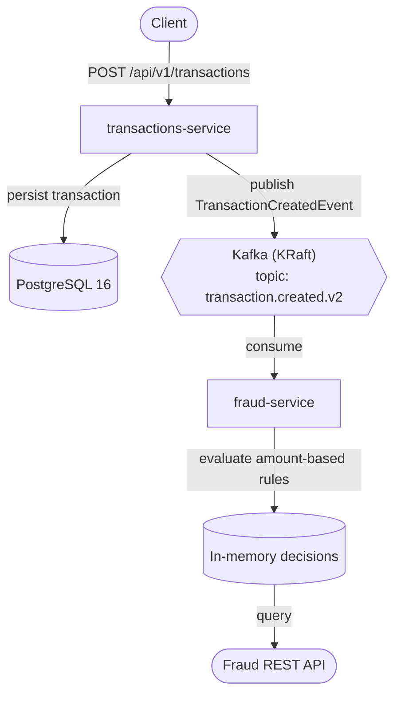

# Card Transactions Kafka Demo

An event-driven backend demo built with **Java 21** and **Spring Boot 4**, showing asynchronous
communication between two microservices over **Apache Kafka 4 (KRaft mode)**, with persistence in
**PostgreSQL** and a **Testcontainers**-backed integration test wired into **GitHub Actions** CI.

This is a portfolio project focused on demonstrating microservice communication patterns,
Kafka fundamentals, and CI/CD basics — it is **not** intended as a production-ready system.
See [Future Improvements](#-future-improvements) for what is deliberately out of scope today.

---

## 🧱 Architecture

| Service | Responsibilities |
|---|---|
| **transactions-service** | Exposes a REST API to create and query card transactions. Validates requests, persists transactions in PostgreSQL, and publishes a `TransactionCreatedEvent` to Kafka after each successful transaction. |
| **fraud-service** | Consumes `TransactionCreatedEvent` from Kafka, applies amount-based fraud rules, and exposes a REST API to query the resulting decisions. Decisions are kept **in memory** — there is no fraud database yet. |

Infrastructure (defined in `docker-compose.yml`):

- **PostgreSQL 16** — owned exclusively by `transactions-service`.
- **Apache Kafka 4.0.0** — single-node broker running in **KRaft mode** (no ZooKeeper).



`transactions-service` and `fraud-service` do not call each other directly — they communicate only
through the Kafka topic. The transaction's status in PostgreSQL is **not** updated with the fraud
outcome; the two services remain independent (see [Event Flow](#-event-flow) for details and current
limitations).

---

## 🛠️ Tech Stack

- **Language:** Java 21
- **Framework:** Spring Boot 4.0.0 (Spring Web, Spring Data JPA, Spring for Apache Kafka)
- **Messaging:** Apache Kafka 4.0.0, KRaft mode
- **Database:** PostgreSQL 16
- **Build tool:** Maven (each service includes the Maven Wrapper)
- **Containerization:** Docker & Docker Compose V2
- **Testing:** JUnit 5, AssertJ, Testcontainers
- **CI:** GitHub Actions

---

## ✅ Prerequisites

This project can be run in two ways, with different local requirements.

**Full Docker Compose** (everything runs in containers):

- Docker
- Docker Compose V2 (`docker compose ...`, bundled with modern Docker Desktop / Docker Engine)

Java and Maven are **not** required on the host in this mode — both services are built inside
multi-stage Dockerfiles.

**Hybrid / Local Development** (infrastructure in Docker, services run on the host):

- Java 21 (Temurin is used in CI; any Java 21 distribution works)
- Docker + Docker Compose V2 (to run PostgreSQL and Kafka)
- No global Maven install needed — each service ships the **Maven Wrapper** (`./mvnw`)

---

## 🚀 How to Run the System

### Option 1 – Full Docker Compose

Everything — database, Kafka and both microservices — runs in Docker.

From the project root:

```bash
docker compose up -d --build
```

This starts:

- `postgres` (container `transactions-postgres`)
- `kafka` (single-node, KRaft mode)
- `transactions-service`
- `fraud-service`

Check container status:

```bash
docker compose ps
```

Exposed ports (host → container):

| Component | Host address | Notes |
|---|---|---|
| transactions-service | `localhost:8080` | REST API |
| fraud-service | `localhost:8081` | REST API |
| PostgreSQL | `localhost:5433` | maps to container port `5432` |
| Kafka (host listener) | `localhost:9092` | for clients running on the host |

Inside the Docker network, `transactions-service` and `fraud-service` reach Kafka at `kafka:29092`
(see [Kafka Listeners](#-kafka-listeners) below).

Stop the stack:

```bash
docker compose down
```

### Option 2 – Hybrid Dev Mode (Docker infra + local services)

Docker runs only the infrastructure (PostgreSQL and Kafka); both microservices run on the host with
the `dev` profile, on ports `8082` and `8083` to avoid clashing with the Docker Compose port mapping.

**1. Start infrastructure only**

```bash
docker compose up -d postgres kafka
```

**2. Start transactions-service**

```bash
cd transactions-service
./mvnw spring-boot:run -Dspring-boot.run.profiles=dev
```

Available at `http://localhost:8082`.

**3. Start fraud-service**

```bash
cd fraud-service
./mvnw spring-boot:run -Dspring-boot.run.profiles=dev
```

Available at `http://localhost:8083`.

Both services connect to the infrastructure started in step 1 via `localhost:5433` (PostgreSQL) and
`localhost:9092` (Kafka). See [`docs/profiles-environments.md`](docs/profiles-environments.md) for
the full profile configuration.

---

## 🔌 Kafka Listeners

The Kafka broker exposes two listeners:

- **`localhost:9092`** — for clients running on the host machine (used by the `dev` profile in
  Hybrid mode, or by any tool run directly from your terminal).
- **`kafka:29092`** — for clients running inside the Docker network (used by
  `transactions-service` and `fraud-service` in Full Docker Compose mode).

Two listeners exist because a container resolves `localhost` to itself, not to the Kafka container.
Advertising a single address to both audiences would let one of them fail to connect. Splitting host
and internal traffic into separate listener names keeps both connection paths correct without extra
client-side configuration.

---

## 🔄 Event Flow

1. A client sends `POST /api/v1/transactions` with `userId` and `amount`.
2. `transactions-service` validates the request and persists the transaction in PostgreSQL with
   status `CREATED`.
3. `transactions-service` publishes a `TransactionCreatedEvent` to the `transaction.created.v2`
   Kafka topic, keyed by `userId`.
4. `fraud-service` consumes the event.
5. `fraud-service` evaluates the transaction amount against fixed thresholds (see
   [Fraud Rules](#-fraud-rules)).
6. `fraud-service` stores the resulting decision **in memory**.
7. The decision can be queried through the fraud-service REST API.

**Current limitations** (by design, at this stage of the project):

- The Kafka publish in step 3 is not wrapped in a distributed transaction with the database write —
  it is a best-effort send, not a guaranteed or exactly-once delivery.
- The transaction's status in PostgreSQL is never updated with the fraud outcome; the two services
  do not talk back to each other.
- Fraud decisions are not persisted and are lost on restart.

---

## 📡 API Examples

### Create a Transaction

**Service:** `transactions-service` · **Port:** `8080` (Docker) / `8082` (Hybrid dev)

```bash
curl -X POST "http://localhost:8080/api/v1/transactions" \
  -H "Content-Type: application/json" \
  -d '{
        "userId": "demo-user",
        "amount": 15000.00
      }'
```

Other read endpoints on the same service:

- `GET /api/v1/transactions/{id}`
- `GET /api/v1/transactions/user/{userId}`
- `GET /api/v1/transactions`

### Query Fraud Decisions

**Service:** `fraud-service` · **Port:** `8081` (Docker) / `8083` (Hybrid dev)

```bash
curl "http://localhost:8081/api/v1/fraud/decisions"
```

```bash
curl "http://localhost:8081/api/v1/fraud/decisions/transaction/1"
```

---

## 🚨 Fraud Rules

`fraud-service` applies a fixed set of amount-based thresholds:

| Amount | Fraud status | Risk level |
|---|---|---|
| `< 10,000` | `CLEAR` | `LOW` |
| `>= 10,000` and `< 50,000` | `REVIEW` | `MEDIUM` |
| `>= 50,000` | `REJECTED` | `HIGH` |

---

## 🧪 Testing & CI

**transactions-service**

- `TransactionRepositoryTest` — a real integration test using **Testcontainers**, spinning up an
  actual PostgreSQL 16 container to verify persistence through `TransactionRepository`.
- `TransactionsServiceApplicationTests` — currently `@Disabled`, pending a dedicated test
  configuration for the full application context.

**fraud-service**

- `FraudServiceApplicationTests` — verifies the application context loads correctly.

Run tests locally from either service directory:

```bash
./mvnw clean verify
```

**Continuous Integration** ([`.github/workflows/ci.yml`](.github/workflows/ci.yml)):

- Triggers on `push` and `pull_request` to `main` and `dev`.
- Sets up JDK 21 (Temurin) with Maven dependency caching.
- Runs `mvn -B clean verify` for both `transactions-service` and `fraud-service` — the full test
  suite executes on every run, it is not skipped.
- GitHub-hosted `ubuntu-latest` runners provide a Docker daemon out of the box, so the
  Testcontainers-based test runs without any extra CI configuration.

This test suite is intentionally small at this stage — it covers persistence and application
context startup, not full end-to-end or Kafka-level integration coverage. Expanding it is listed
under [Future Improvements](#-future-improvements).

---

## 🤝 Collaboration & Branching Model

- **`main`** — protected branch, updated only via Pull Requests from `dev`; represents the stable
  state.
- **`dev`** — default development branch; feature work is integrated here first, then merged into
  `main` via PR.

Typical flow: branch from `dev` → commit changes → open a PR back into `dev` → merge after review →
periodically merge `dev` into `main`.

---

## 📚 Further Documentation

- [Kafka & Docker Cheat Sheet](docs/kafka-docker-cheatsheet.md) — CLI commands for inspecting
  topics, consumer groups, and producing/consuming messages manually.
- [Profiles & Environments](docs/profiles-environments.md) — how Spring profiles and
  environment-specific configuration are structured across both services.

---

## 🧹 Future Improvements

Architectural and operational gaps identified as high-value next steps:

- Kafka retry handling and a Dead Letter Topic (DLT) for poison-pill-safe consumption.
- Consumer-side idempotency / duplicate-event protection.
- Explicit topic provisioning (partitions, replication factor) instead of relying on broker
  auto-creation.
- A transactional outbox pattern to remove the dual-write between PostgreSQL and Kafka.
- Flyway-managed database migrations, replacing `hibernate.ddl-auto: update`.
- Persisting fraud decisions instead of keeping them in memory.
- Broader automated test coverage (fraud-rule unit tests, controller tests, Kafka integration
  tests).
- Observability: metrics and distributed tracing across the Kafka boundary.
- Kubernetes / AKS deployment manifests.
- Configuration hardening (externalized secrets, environment-specific overrides).

---
